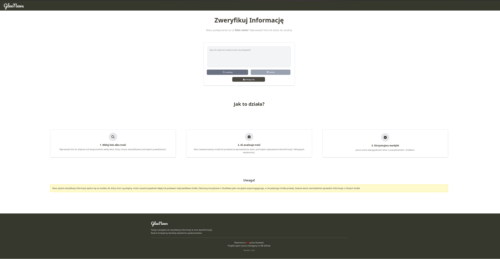

# GlueNews 

**GlueNews** – aplikacja konkursowa stworzona na HackHeroes 2025  
Najlepsze miejsce do sprawdzania wiarygodności informacji i ćwiczenia umiejętności argumentacji w trybie rzeczywistej debaty!



## Założenia projektu

GlueNews to narzędzie stworzone jako odpowiedź na co raz wiekszą ilość fałszywych informacji w Internecie. Celem projektu było stworzenie narzędzia które pomoże rozróżnić fałszywe informacje od tych prawdziwych wykorzystując do tego sztuczną inteligencje która staje się naszą przyszłością.

## WERSJA DEMONSTRACYJNA
Aplikacja jest dostępna pod adresem:
- [GlueNews - demo](https://glueeed.dev:6767)
W przypadku problemów z dostępem do demo prosimy o kontakt poprzez Issues w repozytorium GitHub.
Wersja demo może być okresowo resetowana, a dane użytkowników mogą być usuwane.

## Funkcje aplikacji

- **Weryfikacja informacji** – użytkownicy mogą zgłaszać artykuły lub wiadomości do weryfikacji przez AI.
- **Debaty na żywo** – użytkownicy mogą uczestniczyć w debatach na żywo (real-time), gdzie widownia może głosować na najbardziej przekonujące argumenty.
- **System punktacji** – użytkownicy zdobywają punkty za aktywność i trafność swoich wypowiedzi oraz sensowne argumenty.
- **Ranking użytkowników** – tablica liderów pokazująca najbardziej aktywnych i skutecznych uczestników debat.
- **Interfejs użytkownika** – responsywny i intuicyjny interfejs użytkownika dostosowany do różnych urządzeń.
- **System logowania oraz bezpieczeństwo** – bezpieczne logowanie z dodatkową warstwą ochrony danych logowania podczas przesyłu. Zaimplementowano szyfrowanie danych na czas przesyłu za pomoca AES-256-GCM z jednorazowym kluczem sesyjnym ustalanym przy pomocy [ECDH](https://en.wikipedia.org/wiki/Elliptic-curve_Diffie%E2%80%93Hellman).

## Technologie użyte w projekcie

- **Frontend**: HTML, Tailwind CSS, JavaScript, Socket.IO Client (real-time)

- **Backend**: Node.js, Express, TypeScript, Socket.io, MySQL

- **Kryptografia i bezpieczeństwo**: argon2, noble-ciphers

- **API AI**: Gemini API

- **Inne narzędzia**: Github, WebStorm, Postman

## Wymagania

- Node.js ≥ 20
- MySQL 8.0+
- Klucz API do Gemini

## Instalacja i uruchomienie

1. Sklonuj repozytorium:  
   ```
   git clone https://github.com/Glueeeeed/GlueNews.git
   ```
2. Zainstaluj zależności:  
   ```
   npm install
   ```
3. Skonfiguruj zmienne środowiskowe w pliku `.env`.

4. Użyj pliku `database.sql` do stworzenia struktury bazy danych. Plik znajduje się w katalogu głównym repozytorium.

5. Uruchom bazę danych MySQL i zaimportuj strukturę bazy danych z pliku `database.sql`.

6. Uruchom aplikację:  
   ```
   npm run start
   ```

## Uwaga 
Modele AI mogą generować nieprawdziwe lub nieodpowiednie treści. Użytkownicy powinni korzystać z aplikacji odpowiedzialnie i weryfikować informacje z innych źródeł.
   
## Licencja
Projekt jest dostępny na licencji MIT. Szczegóły w pliku LICENSE.


